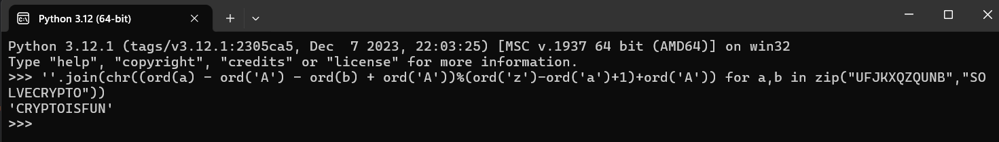

# Easy 1 #

This is the write-up for the challenge "Easy 1" challenge in PicoCTF

# The challenge

## Description
AUTHOR: ALEX FULTON/DANNY

Description
The one time pad can be cryptographically secure, but not when you know the key.
Can you solve this? We've given you the encrypted flag, key, and a table to help
UFJKXQZQUNB with the key of SOLVECRYPTO. Can you use this table to solve it?.
the website:https://play.picoctf.org/?search=Easy1


## Hints
1. Submit your answer in our flag format. For example, if your answer was 'hello', 
you would submit 'picoCTF{HELLO}' as the flag.
2. Please use all caps for the message.


# How to solve it

I open phyton cmd and write:

```>>> ''.join(chr((ord(a) - ord('A') - ord(b) + ord('A'))%(ord('z')-ord('a')+1)+ord('A')) for a,b in zip("UFJKXQZQUNB","SOLVECRYPTO"))```




The flag is `picoCTF{CRYPTOISFUN}`

Thanks 😄

Hadar Liel Harush